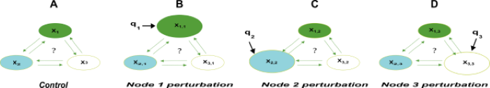
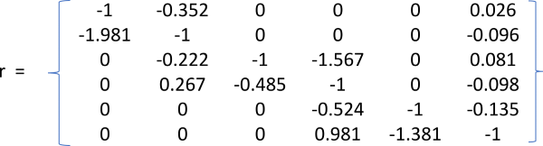
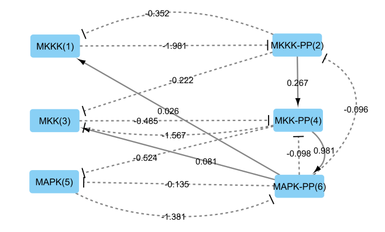
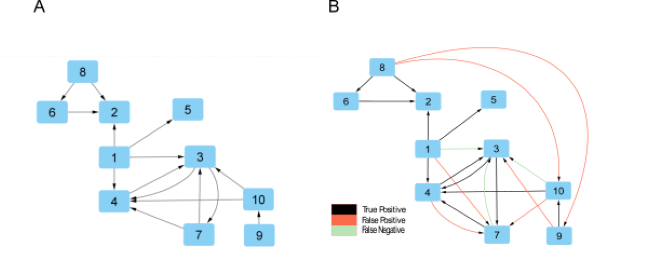

```{r, include = FALSE}
knitr::opts_chunk$set(
  collapse = TRUE,
  comment = "#>"
)
options(rmarkdown.html_vignette.check_title = FALSE)

```

```{r setup}
library(MRARegress)
```
\

# Introduction
\

## What is it for? 

'MRARegress' is used to infer connectivity in biological networks, able of achieving a steady state after being perturbed,
*i.e.* to know if a node (a gene, a transcript, a protein, or even a molecule) affects the action of another one.
This package provides many ways to know about these interactions.
 

## Starting point 

The inference is obtained by using methods based on Multilinear Regression applied to Modular Response Analysis (MRA) principles.
Perturbations are applied to the nodes of a network and the corresponding measurements are done when the steady state is reached. 
If the nodes are gene transcripts, for instance, these measurements may represent their abundance.

The package must know the number of nodes and their names (optionally), and for each node :\
- the value of the measurements when no perturbation is applied to the network (called "control values" or "basal values"),\
- and these values when perturbations are successively applied to the different nodes ("perturbed values").
The number of perturbations may not be the same for every node.

Genes, transcripts, proteins, or molecules must be represented as rows of the "Expression Matrix" (MatExp) and the perturbations as columns:\
- MatExp[i,1] represents the value of the measurement of node i, when no perturbation is applied to the network ("control value of node i"),\
- MatExp[i,j], j > 1, represents the value of the measurement of node i, when a perturbation is applied to node j-1.

HUGO gene symbols (even for proteins) must be used to ensure matching LR*db*, Reactome, and GOBP contents.

From these values, the package computes the "Connectivity Matrix" (r),
where r[i,j] represents the action of node j on node i (r[i,j] > 0 means amplification, r[i,j] < 0 means inhibition and r[i,j] = 0 means that
node j does not influence node i).\
More information is required: see the Reference Manual ("MRARegress").

## How does it work? 

The figure below shows a 3-nodes network:\
- Figure (A) represents the non-perturbed network ("Control"),\
- Figure (B) represents the network when a perturbation ($p_1$) affecting only node 1 is applied,\
- then a perturbation ($p_2$) affecting only node 2 (fig. C) and a perturbation ($p_3$) affecting only node 3 (fig. D) are applied. See (Borg et al, 2023) for details.

\

\

If we note N the number of nodes, $X_i(P_0)$ the "abundance" of node i without any perturbation,\
$X_i(P_0+p_k)$ the "abundance" of node i when the perturbation $p_k$, affecting only node k, is applied,\
and ($\Delta X_i$$)_{p_k}$ = $X_i(P_0+p_k)-X_i(P_0)$, then \
($\Delta X_i$$)_{p_k}$ $\approx$ $\sum_{j = 1, j \ne i}^{N} r_{i,j}$ * ($\Delta X_j$$)_{p_k}$ $(1^{st}$ order Taylor's development).\
So, Multiple Linear Regression methods allow the computation of $r_{i,j}$ from ($\Delta X_j$$)_{p_k}$. Of course, r[i,i] doesn't make sense and is forced to -1 for computation reasons.
\
\
We provide several handy functions to explore the data thru different plots (tables, heatmaps, or networks).

`MRARegress` package functions have many parameters that can be changed by the user to fit specific needs (see Reference Manual for details). 
\
\

Here is an example of a 6-nodes network and the results delivered by the package :

* **Connection matrix "r":**

\

\

For instance, r[2,1] = -1.981 indicates that node "1" inhibits strongly node "2"; r[6,4] = 0.981 indicates that node "4" amplifies the action of node "6".\
\

* **Map of the network:**

A map of the network may be generated directly by the package (direct call to "Cytoscape"). The user may improve the map himself, by moving the nodes, bending the edges, etc... 
(See "Cytoscape Reference Manual" for details). \
The map of the previous 6-nodes network is shown below. The name of the genes, along with the corresponding node number is indicated.
When node "j" affects node "i", an edge is drawn from node "j" toward node "i". A solid black line means "amplification" and a dashed black line, "inhibition". \
\

\
\

* **Another example:**

Here is another example of a 10-nodes network, for which we know its exact structure (thru public databases, like "SPRING" or "REACTOME" for example).
Figure (A) on the left displays the exact structure of the network, while we display, in figure (B), the network discovered by one method of the package ("TLR").\
The black lines correspond to the "True Positive" edges (an edge between nodes A and B is discovered, and this edge actually exists), red lines are "False Positive" edges
(an edge between nodes A and B is discovered, but this edge doesn't actually exist), and green lines are "False Negative" edges 
(an edge between nodes A and B actually exists but is not discovered by the method of the package).

\

\

\


## Parallel mode settings

Users may have to process many networks at a time. They can then reduce computation time by using several processors in parallel.
This is transparent to `MRARegress`. Parallelization has to be done outside `MRARegress`.

### Notes:

* For operating systems that can fork, such as all the UNIX-like systems,
it might be preferable to use the library `doMC` that is faster (less
overhead). This is transparent to `MRARegress`.

* In case you need to reproduce results exactly and since statistical
model parameter learning involves the generation of randomized expression
matrices, you might want to use `set.seed()`. In a parallel mode,
`iseed` that is a parameter of `clusterSetRNGStream`, must be used.

\

## How to use the "package"?

1/ After having made the measurements and got the "Expression Matrix", the User must call the MRARegress::MRARegress function, which returns the "Connectivity Matrix" ($r) and other results.\
2/ Then the User may call a "visualization function", using the previous results as a parameter. This function may be:\
-  MRARegress::rCI, which computes the confidence intervals of the r[i,j],\
-  MRARegress::DrawHeat, which represents "r" as a "matrix heat chart",\
-  MRARegress::DrawGraph, which displays "r" as a graph where the nodes are the genes (for instance) and an edge A $\rightarrow$ B reflects the action of node A on node B (amplification),\
	a dashed line (with a "T" arrow  between A and B) reflects an inhibition of node B by node A.\
-  MRARegress::DrawGraphML, which records an XML file, describing "r" as a graph in GraphML format,\
-  MRARegress::Classify, which discretizes the connectivity coefficients, according to a classification rule,\
-  MRARegress::Score, which computes the performance of the method versus a "reference" got by other ways,\
-  MRARegress::DrawDiscr, which displays the performance as a graph showing "True Positive", "False Positive", and "False Negative" edges.\
-  MRARegress::RocPR, which displays the ROC curve, the PR curve, the areas under these curves (AuROC and AuPR), the p-value AuROC.\
The availability of these functions will depend on the input data supplied to the package.\
\

# First Example  

This is the code used to generate the connectivity matrix and the map of the 6-nodes network described above.\

## Loading the data

Here, we load the data

```{r eval=FALSE}
data(MatExp1)
```  
and we call "MRARegress" to get the Connectivity Matrix (saved as "MatrCc"), then we call "DrawGraph" to draw the network. The drawing quality is manually improved (moving nodes, bending edges).

```{r }
Ret	<- MRARegress (MatExp1)					# Perturb = NULL, NodeName = NULL, KnlgMap = NULL, Method = "TLR", MapExper = NULL, Verbose = FALSE (default values)
if (! is.null(Ret)) {
	Dg	<- DrawGraph (Ret)
}
```

\ \ 

# Second Example  

This example corresponds to the 10-nodes network described above ("Another example").\
We know the exact structure of the network in this case, so we can compute classification scores, and then represent the discovered network, the missing and the wrong edges.\

## Loading the data

Here, we load the data for this example

```{r eval=FALSE}
data(MatExp2)
data(Perturb2)
data(Solution_10_1)
```  
and we call again "MRARegress" to get the Connectivity Matrix (saved as "MatrCc$r"), then we call "Classify" to detect the edges and "DrawDiscr" to draw 
the discovered network, the missing and the wrong edges. The drawing quality is also manually improved.
To see the results, you need to launch "Cytoscape" (version >= 3.6.1), then execute the following commands with RStudio :
The graph will be visible in "Cytoscape". Black solid lines correspond to "True Positive" edges, red solid lines correspond to "False Positive" and green solid lines to "False Negative" edges .

```{r }
Dg	<- DrawGraph (Solution)								# Draws the first image
Ret	<- MRARegress (MatExp2, Perturb2)					# NodeName = NULL, KnlgMap = NULL, Method = "TLR", MapExper = NULL, Verbose = FALSE (default values)
														# MatExp2 has 10 rows and 21 columns. Perturb is mandatory.
if (! is.null(Ret)) {
	MatrCcDiscr	<- Classify(Ret)						# Classes = c(0,1), Method = "TLR", Lbda = NULL (default values)
	Trash <- DrawDiscr (MatrCcDiscr, Solution)			# Draws the second image
}
```

\
